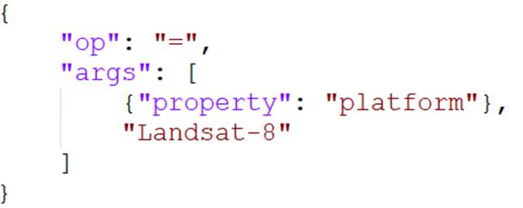
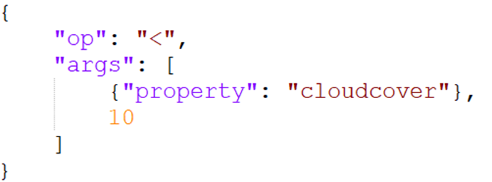
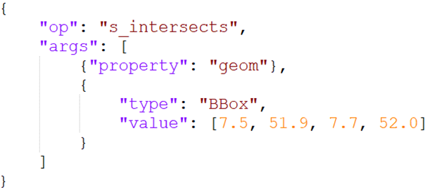
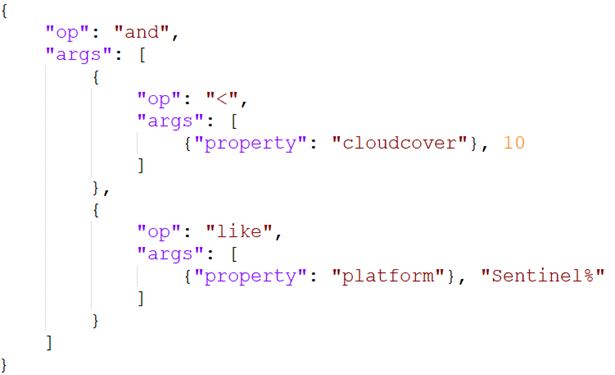

# OGC Common Query Language 2 (CQL2) (#7)

[@luis-waldi](https://github.com/luis-waldi)  
[@nils-gb156](https://github.com/nils-gb156)  

## 1. Einstieg & Motivation

### Leitfrage:

Stell euch vor, ihr wollt alle Sentinel-2-Bilder über Münster, mit weniger als 10% Wolken finden.  
Klingt einfach, war aber technisch lange kompliziert. Jede API hatte ihre eigene Sprache, eigene Filter, eigene Syntax.  
Hier setzt CQL2 an.

### Warum brauchen wir CQL2?

- Filtern ist eine Grundfunktion in Geodaten-APIs
- Alte OGC-Standards (Filter Encoding, CQL 1) sind komplex, XML-basiert, schwer erweiterbar
- Web-APIs brauchen eine einfache und einheitliche Filtersprache
- CQL2: kompakt, verständlich und interoperabel – die moderne Weiterentwicklung
- Ziel: Einheitliche Filterlogik für STAC & OGC API & andere Dienste

## 2. Was ist CQL2?

- Offizieller OGC-Standard für Filterausdrücke (Version 1.0, 2024)
- Ermöglicht logische, räumliche & zeitliche Abfragen
- Zwei Schreibweisen: Text vs. JSON
- Standardisiert und kompatibel mit STAC & OGC API

## 3. Syntaxvarianten (Text vs JSON)

### Text-Encoding

- Menschlich lesbare Syntax (ähnelt SQL)
- Kompakt & gut für URL-Parameter geeignet
- Unterstützt logische, räumliche & zeitliche Filter
- Wird von OGC API - Features, Records & STAC unterstützt

### JSON-Encoding

- Maschinenlesbar (JSON-Struktur)
- Ideal für Web-APOs und zur Programmierung
- Besser validierbar & einfacher zu parsen
- Gleiche Logik wie Text-Encoding

## 4. Operatorenüberblick

### Vergleichoperatoren

- `=`, `<>`, `<`, `>`, `BETWEEN`, `LIKE`, `IN`
- Vergleich von Attributen & Werten

### Logische Operatoren

- `AND`, `OR`, `NOT`
- Kombinieren von Bedingungen

### Räumliche Operatoren

- `S_INTERSECTS`, `S_CONTAINS`, `S_CROSSES`, `S_DISJOINT`, `S_EQUALS`, `S_OVERLEAPS`, `S_TOUCHES`, `S_WITHIN`
- Beziehungen zwischen Geometrien

### Zeitliche Operatoren

- `T_BEFORE`, `T_AFTER`, `T_DURING`, `T_EQUALS`, …
- Vergleich zeitlicher Eigenschaften

>Jeder Ausdruck wertet entweder als `true`, `false` oder `null` aus.

## 5. Beispiel-Filter (Text + JSON)

### Beispiel-Daten:

| ID | platform    | cloud_cover (%) | date       | region    | geom |
|----|-------------|-----------------|------------|-----------|------|
| 1  | Sentinel-2A | 8               | 2024-03-15 | Münster   | POLYGON((7.5 51.9, 7.7 51.9, 7.7 52.0, 7.5 52.0, 7.5 51.9)) |
| 2  | Sentinel-2B | 23              | 2024-04-20 | Münster   | POLYGON((7.6 51.8, 7.8 51.8, 7.8 51.9, 7.6 51.9, 7.6 51.8)) |
| 3  | Landsat-8   | 12              | 2023-03-08 | Münster   | POLYGON((7.5 52.0, 7.7 52.0, 7.7 52.2, 7.5 52.2, 7.5 52.0)) |
| 4  | Sentinel-2A | 5               | 2025-03-08 | Münster   | POLYGON((7.4 51.9, 7.6 51.9, 7.6 52.0, 7.4 52.0, 7.4 51.9)) |
| 5  | Landsat-9   | 40              | 2025-04-11 | Paderborn | POLYGON((8.0 51.7, 8.2 51.7, 8.2 51.9, 8.0 51.9, 8.0 51.7)) |

### Beispiele

| Abfrage | Text | JSON |
|---|------|------|
| Landsat-8 Datensätze | `platform = 'Landsat-8'` |  |
| Weniger als 10% Wolken | `cloudcover < 10` |  |
| Bilder, die Münster überdecken | `S_INTERSECTS(geom, BBOX(7.5, 51.9, 7.7, 52.0))` |  |
| Sentinel-Bilder mit wenig Wolken | `cloudcover < 10 AND platform LIKE 'Sentinel%'` |  |

## 6. Anwendung in STAC & OGC API

### STAC

- STAC = SpatioTemporal Asset Catalog  
    API zum Durchsuchen und Filtern georäumlicher Sammlungen
- Unterstützt CQL2 zur präzisen Suche nach Items
- Formate für Filter:  
    Text-Encoding: einfach in GET-Requests
    JSON-Encoding: komplexere Filter per POST    
- Beispiel:  
    GET /collections/satellite_data/items?filter-lang=cql2-text&filter=cloudcover<10

    POST /search  
    ```json
    {
      "filter-lang": "cql2-json",
      "filter": {
        "op": "<",
        "args": [
          {"property": "cloudcover"},
          10
        ]
      }
    }
    ```

### OGC API

- OGC API = REST-basierter Standard des Open Geospatial Consortium (OGC)
- Nutz dieselbe CQL2-Syntax für Filterparameter
- Filter werden bei POST-Requests im JSON-Body übergeben
- Ermöglicht strukturierte Abfragen auf Feature-Daten
- Gleiche Syntax -> kompatibel zwischen OGC API & STAC API

## 7. Fazit

- Einheitliche, moderne Filtersprache für alle OGC-konformen Dienste
- Erhöht Interoperabilität: einmal formulieren --> überall nutzbar
- Verständlich für Menschen (Text) & Maschinen (JSON)
- Ablösen komplexer XML-Filter älterer Standards
- Grundlage für präzise, standardisierte Geodatenabfragen (z. B. in STAC, OGC API)
- Verweis auf offizielle Dokumentation vom OGC [https://docs.ogc.org/is/21-065r2/21-065r2.html ](https://docs.ogc.org/is/21-065r2/21-065r2.html)

## 8. Quellen

- [https://www.ogc.org/standards/cql2](https://www.ogc.org/standards/cql2)
- [https://www.ogc.org/announcement/ogc-membership-approves-common-query-language-cql2-as-an-official-ogc-standard](https://www.ogc.org/announcement/ogc-membership-approves-common-query-language-cql2-as-an-official-ogc-standard)
- [https://docs.ogc.org/is/21-065r2/21-065r2.html](https://docs.ogc.org/is/21-065r2/21-065r2.html)
