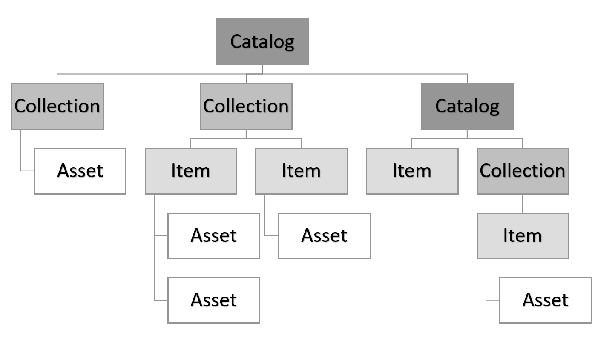

# STAC – SpatioTemporal Asset Catalog

**Kurs:** Geosoftware II, Wintersemester 2025/26  
**Bearbeitet von:** Hannah Schulte-Terboven (@HannahS-T) & Jan Jakob Wotka (@vertrox78)  

## Überblick

STAC (SpatioTemporal Asset Catalog) ist ein offener Standard zur Beschreibung, Katalogisierung und Suche von georäumlichen Daten mit Raum- und Zeitbezug, wie z. B. Satellitenbildern, Drohnendaten oder Fernerkundungsprodukten.

### Zielsetzung

- Einheitliche Metadatenstruktur für georäumliche Assets
- Interoperabilität zwischen Datenanbietern, Clouds und Tools
- Ermöglicht effizientes Durchsuchen und Abrufen großer Datensätze
- Unterstützt sowohl statische Kataloge als auch dynamische STAC-APIs

STAC stellt sicher, dass raum-zeitliche Assets leicht auffindbar, zugänglich und wiederverwendbar sind – unabhängig vom Speicherort und -format.

## STAC-Komponenten

### Strukturelle Komponenten

Die STAC-Spezifikation besteht aus 3 zentralen Komponenten. Jede Komponente kann einzeln benutzt werden, aber sie funktionieren am sinnvollsten zusammen.
Die Komponenten folgen einer hierarchischen Struktur, wodurch Geodaten auch vollständig statisch organisiert werden können.

---

Die zentralen strukturellen Einheiten der STAC-Spezifikation sind: 

### `Item`
Ein STAC Item ist die Basiseinheit der STAC-Spezifikation.  
Es beschreibt das tatsächliche räumlich-zeitliche Datenobjekt (spatio-temporal Asset) mit zugehörigen Metadaten.  
Es basiert auf einem GeoJSON Feature, das um zusätzliche Felder erweitert wird. 

**Felder:**

| Feld           | Beschreibung                                   |
|----------------|-----------------------------------------------|
| stac_version | Version der STAC-Spezifikation, nach der das Item erstellt wurde (z. B. "1.0.0").             |
| id           | Eindeutiger Bezeichner des Items              |
| type         | Muss "Feature" sein                          |
| geometry     | GeoJSON Geometrie (Punkt, Polygon, etc.)       |
| bbox         | Bounding Box (minimales umschließendes Rechteck) |
| properties.datetime    | Zeitpunkt der Datenerfassung                  |
| links       | Verweise auf Collection oder verwandte Items |
| assets       | Tatsächliche Datenressource (z. B. Satellitenbilder) |
| collection  | Optional: ID der Collection, zu der das Item gehört |
|weitere Felder| ... |  

**Beispiel:**
```json
{
  "type": "Feature",
  "stac_version": "1.0.0",
  "id": "example-item",
  "geometry": { "type": "Point", "coordinates": [7.0, 51.0] },
  "bbox": [7.0, 51.0, 7.0, 51.0],
  "properties": { "datetime": "2020-01-01T00:00:00Z" },
  "assets": { "image": { "href": "https://example.com/image.tif", "type": "image/tiff" } },
  "links": []
}
```   

*Weitere Informationen:* [item-spec](https://github.com/radiantearth/stac-spec/blob/master/item-spec/item-spec.md)

---

### `Collection`
Eine Collection beschreibt eine Gruppe verwandter Items mit gemeinsamen Metadaten. Sie enthält zusätzliche Informationen zu einer gesamten Datensammlung wie:
- Lizenz​
- räumliche und zeitliche Ausdehnung​
- Schlüsselwörter​
- Anbieter​
- Zusammenfassungen​

Eine Collection kann sowohl übergeordnete (parent) Catalog- oder Collection-Objekte haben als auch untergeordnete (child) Item- oder Collection-Objekte.​

**Felder:**

| Feld           | Beschreibung                                   |
|----------------|-----------------------------------------------|
| stac_version | Version der STAC-Spezifikation     |
| id           | Eindeutiger Bezeichner der Collection         |
| type         | Muss "Collection" sein                       |
| description  | Beschreibung der Inhalte                      |
| extent       | Zeitliche (interval) und räumliche (spatial) Abdeckung |
| links        | Verweise auf Items oder übergeordnete Catalogs |
| license |  Lizenz der Datensammlung             |
| title | Optional: kurzer Titel der Datensammlung              |
| keywords | Optional: Schlüsselwörter zur Beschreibung           |
| providers | Optional: Information zum Datenanbieter             |
| summaries | Optional: Zusammenfassungen von Eigentschaften der enthaltenen Items             |
| weitere Felder | ... |  

**Beispiel:**
```json
{
  "stac_version": "1.0.0",
  "type": "Collection",
  "id": "example-collection",
  "description": "Example collection of satellite images.",
  "license": "CC-BY-4.0",
  "extent": {
    "spatial": { "bbox": [[6.0, 50.0, 8.0, 52.0]] },
    "temporal": { "interval": [["2020-01-01T00:00:00Z", null]] }
  },
  "links": []
}
```

*Weitere Informationen:* [collection-spec](https://github.com/radiantearth/stac-spec/tree/master/collection-spec)

---

### `Catalog`
Legt fest, wie andere STAC-Objekte (z. B. Collections oder weitere Catalogs) verknüpft werden und bilden eine hierarchische Datenstruktur. Er basiert auf einer einfachen JSON-Struktur und enthält selbst keine Daten, sondern Links zu den anderen STAC-Objekten.    
Er ist vergleichbar mit einem Ordner in einer Dateistruktur und dient der Organisation und Navigation innerhalb der STAC-Daten.

Ziele:
1. Große Collections unterteilen, um sie übersichtlicher zu machen (z. B. nach Geografie oder Zeit)​
2. Mehrere Collections zusammenfassen, um eine übergeordnete Übersicht zu schaffen (z. B. als Einstiegspunkt in verschiedene Datensätze)​

**Felder:**

| Feld           | Beschreibung                                   |
|----------------|-----------------------------------------------|
| stac_version | Version der STAC-Spezifikation     |
| id           | Eindeutiger Bezeichner des Katalogs           |
| type         | Muss "Catalog" sein                          |
| description  | Kurze Beschreibung des Inhalts                |
| links        | Verweise auf untergeordnete Objekte (Items, Collections, Catalogs) |
| title | Optional: kurzer Titel des Katalogs              |
|weitere Felder | ... |  

**Beispiel:**
```json
{
  "stac_version": "1.0.0",
  "id": "example-catalog",
  "type": "Catalog",
  "description": "Top-level STAC catalog example.",
  "links": [
    { "rel": "child", "href": "./example-collection.json", "type": "application/json" }
  ]
}
```

*Weitere Informationen:* [catalog-spec](https://github.com/radiantearth/stac-spec/tree/master/catalog-spec)

---

### Inhaltliche Komponenten
Des Weiteren gibt es noch die inhaltlichen Komponenten, die innerhalb der strukturellen Komponenten vorkommen und Informationen oder Verknüpfungen bereitstellen:  

---

### `Asset`
Ein Asset ist das eigentliche Datenobjekt, auf das ein Item verweist (z. B. Bilddatei, GeoTIFF, NetCDF). Jedes Asset ist über eine URL erreichbar und enthält Metadaten wie:
- Format/Typ der Datei
- Rolle oder Zweck (z. B. „thumbnail“, „data“, „metadata“)  

Assets sind also die Datenressourcen, während das Item deren Metadatenbeschreibung bereitstellt.

| Feld         | Beschreibung |
|--------------|-------------|
| href       | Pfad oder URL zur Datei |
| type       | Medientyp der Datei (z. B. "image/tiff") |
| title      | Optional: Kurzer Titel des Assets  |
| roles      | Optional: Rolle des Assets, wofür wird es verwendet (z. B. "thumbnail", "data") |
| description| Optional: Längere Beschreibung des Assets |
|weitere Felder | ... | 

*Weitere Informationen*: [assets](https://github.com/radiantearth/stac-spec/blob/master/commons/assets.md)

---

### `Link`
Ein Link verbindet verschiedene STAC-Objekte miteinander oder verbindet externe Ressourcen.
Er ermöglicht die Navigation innerhalb der STAC-Struktur und beschreibt die logische Beziehung zwischen den Objekten.

| Feld        | Beschreibung |
|------------|-------------|
| href     | URL oder Pfad zum Zielobjekt |
| rel      | Beziehungstyp des Links (z. B. "self", "parent", "collection") |
| type     | Optional: Medientyp des Zielobjekts |
| title    | Optional: Kurzbeschreibung des Links  |
|weitere Felder | ... |

*Weitere Informationen:* [links](https://github.com/radiantearth/stac-spec/blob/master/commons/links.md)


## STAC-Hierarchie 



## STAC-Erweiterungen (Extensions)

STAC soll bewusst minimalistisch sein und kann über Erweiterungen mit zusätzlichen Funktionalitäten ergänzt werden. So kann eine große Bandbreite an Anwendungsfällen unterstützt werden.
Erweiterungen (Extensions) fügen der Kernstruktur zusätzliche Funktionalitäten hinzu, z. B. Sensorinformationen, Wolkenbedeckung oder detaillierte Zeit-/Raumangaben. Sie bleiben kompatibel mit der Basisstruktur und werden als eigenständige JSON-Schemata implementiert.

Verwendung: 
- im STAC-Objekt können die Erweiterungen im Feld `stac_extensions` aufgelistet werden
- Nach der Deklaration können die zusätzlichen Felder der Extension im STAC-Objekt  genutzt werden, z.B. "proj:epsg: 32632"
<br><br>

  
**Beispiele:**

| Extension | Anwendungsbereich | Beispielhafte Felder | Beschreibung |
|----------------|-------------------------------|---------------------------|-------------------|
| `eo`  | Multi-spektrale Satellitendaten (z. B. Sentinel-2, Landsat) | `eo:bands`, `eo:cloud_cover`, `eo:sun_azimuth` | Beschreibt spektrale Bänder, Sensorparameter und Wolkenbedeckung für optische Erdbeobachtungsdaten |
| `sar` | Radar-Daten (z. B. Sentinel-1) | `sar:polarizations`, `sar:frequency_band`, `sar:product_type` | Ergänzt Metadaten zu Polarisation, Frequenzband und Produkttyp für SAR-Daten |
| `pointcloud` | 3D-Daten / LiDAR / Drohnenbefliegungen | `pc:type`, `pc:count`, `pc:density` | Beschreibt Punktwolken mit Angaben zu Punktanzahl, Dichte und Klassifizierung |
| `datacube` | Zeitreihen-, Klima- und Wetterdaten | `cube:dimensions`, `cube:variables` | Modelliert mehrdimensionale Raum-Zeit-Daten (z. B. Temperatur, Niederschlag) |
| `projection` | Koordinatensysteme und Georeferenzierung | `proj:epsg`, `proj:bbox`, `proj:shape` | Fügt Informationen zu Projektionen und CRS hinzu, wichtig für GIS-Analysen |
| `language` | Mehrsprachige Metadaten | `lang:titles`, `lang:descriptions` | Unterstützt mehrsprachige Titel, Beschreibungen und Schlüsselwörter in STAC-Metadaten |

*Weitere Informationen:* [extensions](https://github.com/radiantearth/stac-spec/tree/master/extensions)

---

## Vorteile von STAC

JSON-basiert, leichtgewichtig und einfach zu verarbeiten

Flexibel einsetzbar (Dateisysteme, APIs, Cloud-native)

Unterstützt moderne Formate wie Cloud-Optimized GeoTIFF (COG)

Erweiterbar über standardisierte Extensions

Offener Standard mit breiter Community und Tool-Unterstützung

---

## Quellen
- STAC Spec Repository auf GitHub: https://github.com/radiantearth/stac-spec
- STAC Specification: https://stacspec.org/en
- EO College – The STAC Catalog: https://eo-college.org/topics/the-stac-catalog/

